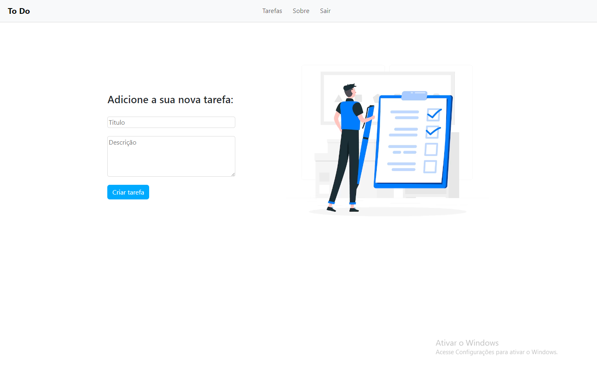

<div align="center">

# To Do list

#### Projeto feito em Django como forma de estudo.

</div>

--- 

### Tecnolgias Utilizadas:

   

### Ferramentas Utilizadas:

  

---
## Detalhes:
Iniciado no dia 18/02/23 e finalizado no dia 27/02/23.

Projeto feito com base em paralelo de video aulas durante o curso de django do canal "Hora de Codar" de Matheus Battisti.

---
## Aprendizados Tecnicos:
A algum tempo tenho como objetivo aprender a utilizar Django para desenvolver aplicações web, e esse projeto posso dizer que me fez dar passos maiores para cumprir esse objetivo.

---
## Como usar?

### 1. Clone esse repositório;

Para clonar esse repositório na sua maquina, utilize o comando git clone juntamente a URL desse repositório, assim:

```git clone https://github.com/JonathasSC/ToDo```

### 2. Criando ambiente virtual;

Após clonar o repositório em sua maquina, abra um terminal na raiz e efetue esse comando para criar um ambiente virtual: 
```python -m venv venv-todo```

Perceba se foi criado uma pasta com o nome venv-todo na raiz, se sim, efetue esse comando para ativar seu ambiente virtual:
```./venv-todo/Scripts/Activate```

### 3. Instale a lista de requerimentos para o projeto funcionar.

Para instalar todos os pacotes necessarios para que o projeto
 seja executado corretamente, será necessario efetuar esse comando:
```pip install -r requirements.txt```

### 4. Execute o projeto em seu computador:

Com tudo instalado, execute o projeto no seu computador entrando na pasta "todo" dentro da raiz, e logo após efetuando "python .\manage.py runserver", nesta ordem: 
```cd todo```

```python .\manage.py runserver```

---

## Visualize por aqui

### 1. Tela de login

Logo ao entrar, haverá a tela de login para acessar sua conta, caso não tenha uma, clique em "Clique aqui"


---

### 1. Tela de Registro

Após clicar para se registrar, apresentarar um formulário para criação de sua conta utilizando seu nome de usuário e senha.


--- 

### Tela principal - Lista de tarefas

Após registrar-se e fazer login, você será direcionado para a tela principal da aplicação, podendo visualizar as tarefas finalizadas nos ultimos 30 dias, todas realizadas e tarefas ainda não feitas.

Além do botão de adicionar tarefa e do mecanismo de filtro para buscar alguma tarefa em especifica.


--- 

### Adicionar uma nova tarefa

Ao clicar em adicionar tarefa na tela principal, você é direcionado para uma tela de formulário para criar sua tarefa, basta preenche-lo e clicar em "criar tarefa".



--- 

### Manipular tarefa

Voltando para a tela principal, após adicionar uma tarefa, percebemos que ela aparece logo abaixo. 

A tarefa possui 3 botões na mesma linha da tarefa na outra extremidade, esses são:

mudar o status da tarefa para "concluido":

para editar a tarefa:

deletar a tarefa:
